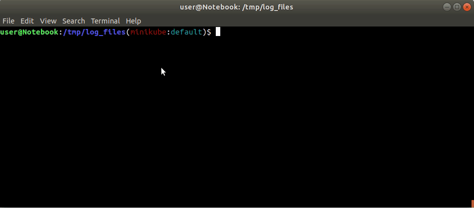
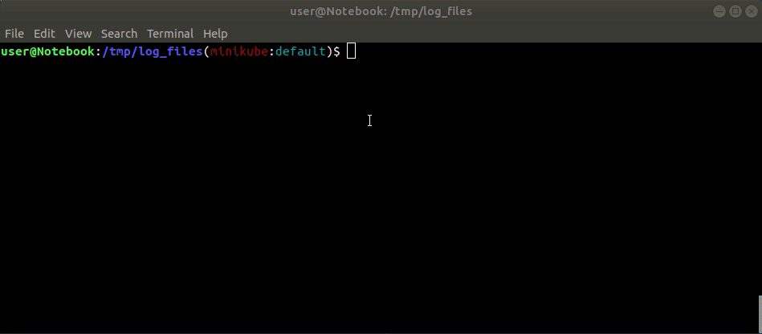

<!--
  Title: kubelogs
  Description: Interactively dump logs from multiple Kubernetes containers.
  Author: eduardobaitello
  -->

# kubelogs
It is a bash script that uses your current _kubectl context_ to interactively select namespaces and multiple pods to download logs from. It basically runs _kubectl logs_ in a loop for all containers, redirecting the logs to local files.

## Prerequisites
kubelogs relies on [whiptail](https://linux.die.net/man/1/whiptail) to enable interactive selection.

Whiptail is included by default on Debian. If you are using another OS, make sure to have it installed:

### Linux
`yum install newt` or `apt-get install whiptail`

### MacOS
`brew install newt`

## Installation
Just download the [kubelogs](kubelogs) file and it's done (download from [releases](https://github.com/eduardobaitello/kubelogs/releases) to get stable ones).

## Usage
Run `kubelogs` without any flags to:
* Interactively select a namespace from current context
* Interactively select multiple pods to dump logs from (space bar to check, enter to confirm)
* Input a output dir for log files

Output filenames are created in the form `pod_container.log`

Use `kubelogs --help` for all available options and examples.

### Skipping some interactive steps
Optionally, the `--namespace` and `--output-dir` flags can be used to skip namespace selection and/or typing of output dir (entirely skipping of _whiptail_ is not supported yet).

### Inherited flags
Some flags can be passed to _kubectl logs_ that runs under the hood. Use `kubelogs --help` to see the available ones.

### Environment
kubelogs supports the following option values from environment variables:
```
KUBELOGS_NAMESPACE
KUBELOGS_OUTPUT_DIR
KUBELOGS_TAIL
KUBELOGS_TIMESTAMPS
```

## Examples
### Default flags


### Skipping interactive steps


## Contribute
Pull requests are welcome!
Feel free to open an issue to report bugs or requesting new features.
